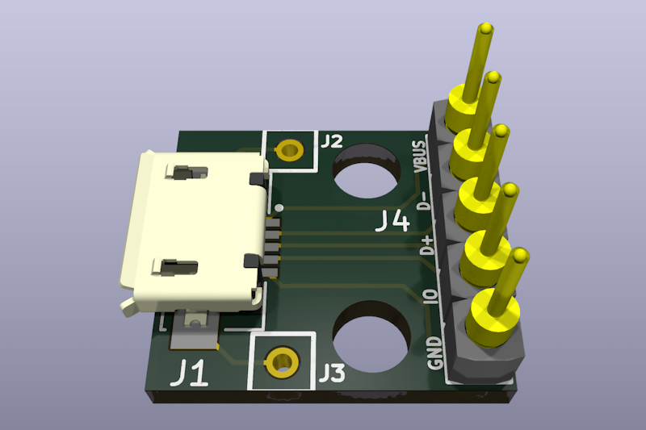
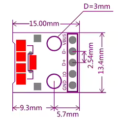
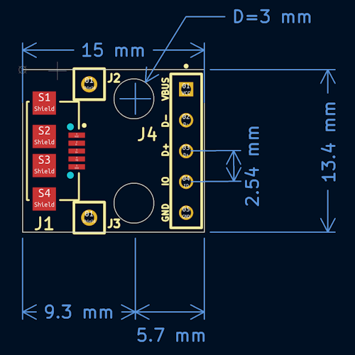
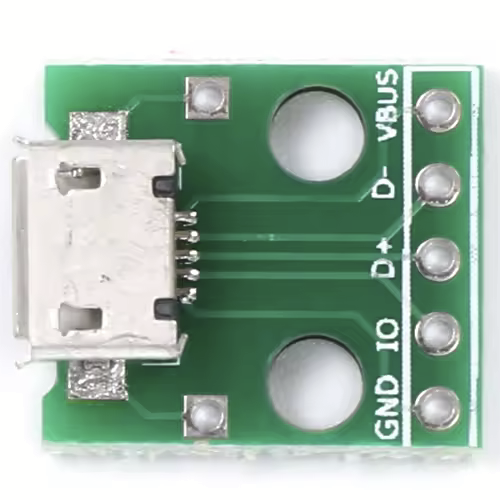
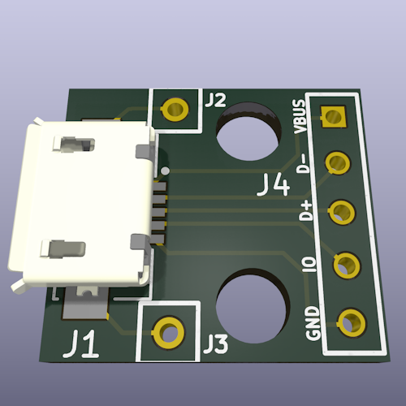

# MicroUSB2DIP

## Overview

This is an open-source reverse-engineered version of a Micro USB to DIP adapter, based on the original component available [here](https://fr.aliexpress.com/item/32947889760.html). The goal of this project was to practice reverse engineering as a learning exercise and to prepare for a future adaptation in a larger project.

## Purpose
- **Reverse engineering**: Understanding the design and functionality of the original adapter.
- **Skill development**: Improving PCB design and hardware analysis skills.
- **Future adaptation**: Using the knowledge gained to design a custom version for a more complex project.

## Before & After: Original vs. Reverse-Engineered

| Feature            | Original Adapter | Reverse-Engineered Version |
|--------------------|----------------|---------------------------|
| PCB Design        | Proprietary     | Open-source & customizable |
| Connector Type    | Micro USB       | Micro USB |
| Pin Mapping      | Standard DIP    | Standard DIP |
| Mechanical Drawing  |  |  |
| Photo        |  |  |

## License
This project is open-source. Feel free to use, modify, and contribute!
